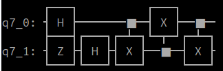
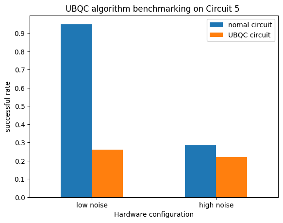

# SecNisQ

VeriQloud

Chin-Te, LIAO

This document describes the tasks that had been done in the project SecNisQ.

## SquidASM protocol update

### W-state Anonymous Transmission simulation
Quantum Anonymous Transmission protocol works between multiple nodes. Currently our protocol simulates 4 parties. The protocol aims to transfer information anonymously among a group of users, meaning that the receiver does not know who among the group has sent the message. Code in NetSquid could be found [here](https://github.com/LiaoChinTe/netsquid-simulation/tree/main/AnonymousTransmission).

Due to the fact that SquidASM is not able to perform multi party protocols in the current version. To write the protocol code, I am obligated to perform a trick to get around with the mechanism. Letting some nodes play multiple roles in the protocol while maintaining the correctness of protocol steps. This modification does  not cost too much effort to adjust to multi party once it is available.

### Three parties quantum gates build in SquidASM
One challenge of making w-state anonymous transmission simulation is that three-qubits gates were not defined in SquidASM. To complete the protocol, Toffoli and inverse Toffoli gates are required. I need to add a series of codes to the SquidASM source as well as the NetQASM library to use such gates at application level.
Toffoli and inverse Toffoli gates were successfully built and verified. Furthermore, I created a patch that enables any SquidASM user to upgrade his/her SquidASM/NetQASM/NetSquid to my customized version.

## Maintenance of backward simulation code in NetSquid

The software stack in the research paper [Benchmarking of Quantum Protocols](https://arxiv.org/abs/2111.02527) enabled us to perform backward simulation, which aims to output hardware requirements by the figure of merit desired as input in a given protocol.

Such software stack is not designed along with the protocol simulation code. Therefore, some integration is required to make the two pieces of code working together. For each protocol, one needs to write some scripts dedicated to software integration. For now we have such a script for quantum token only. I updated the code so that it would be much easier to use or extend to other protocols in the future.   

##  UBQC compiler updating

We have build an UBQC compiler which compiles quantum circuit into UBQC program in SquidASM. [source code](https://github.com/Veriqloud/ubqc_squidasm). This compiler provides a convenient environment to benchmark the [UBQC algorithm](https://arxiv.org/abs/0807.4154).

### Noise case simulation

To simulate more realistic cases, we applied two different levels of noises to the simulator. We select circuit 5 from the default circuit as an example:

The reason for using this circuit is that it has low complexity and still features many single and two qubits gates. 

Here are the results:

[hardware configuration](https://github.com/Veriqloud/ubqc_squidasm/blob/main/Jupyter-notebook/noise_eample/plotTest_sample200.txt)

As we can see, the high noise has a significant impact on the successful rate of the protocol in normal circuit cases. However, it does not have much effect on UBQC cases. Although the successful rate of UBQC cases in general are much lower than the normal cases, we can say UBQC circuits have better resistance against noises as the figure shows.  

